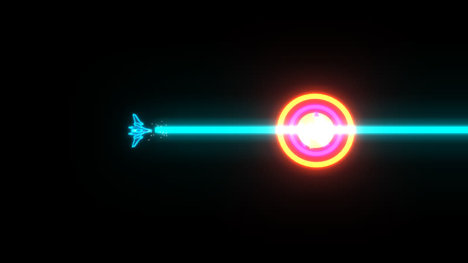
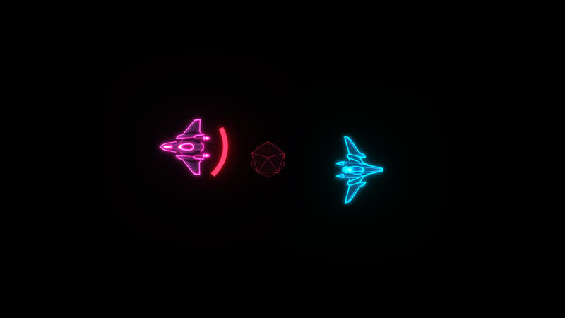
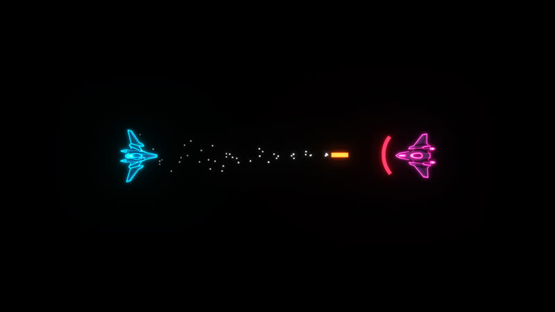
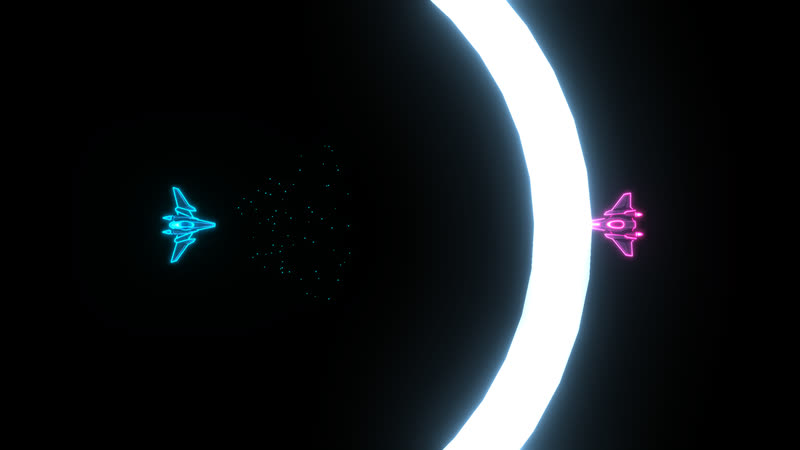
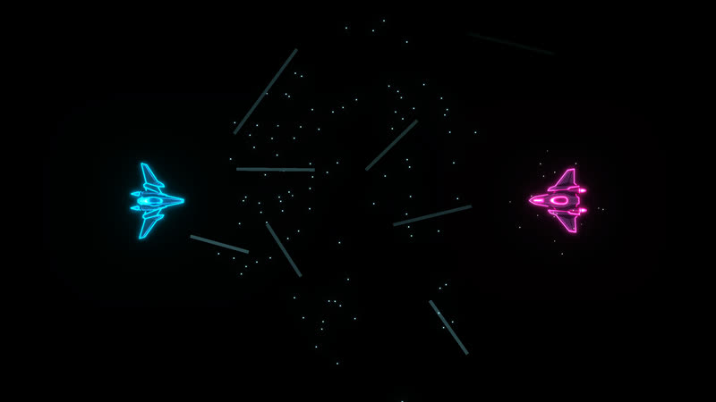
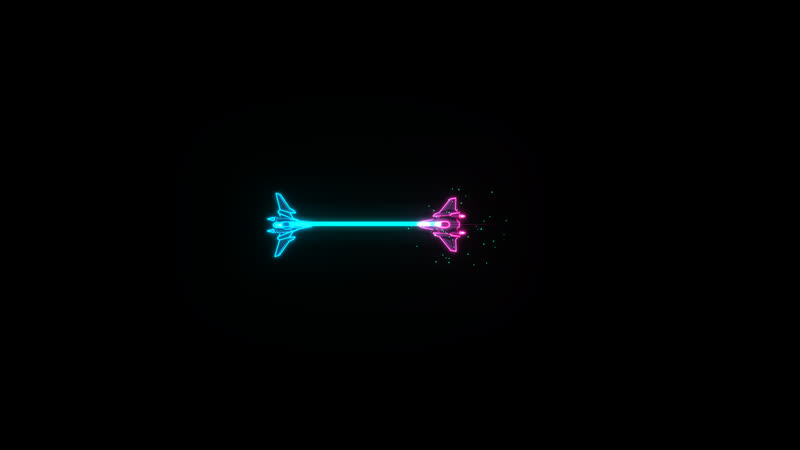
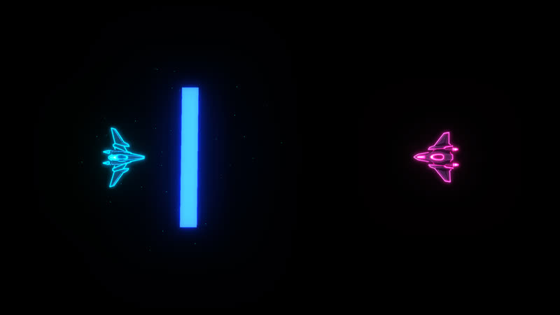
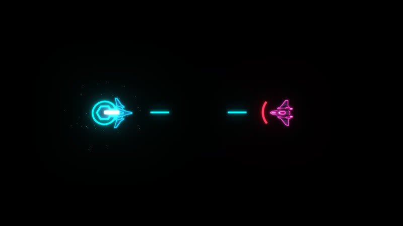
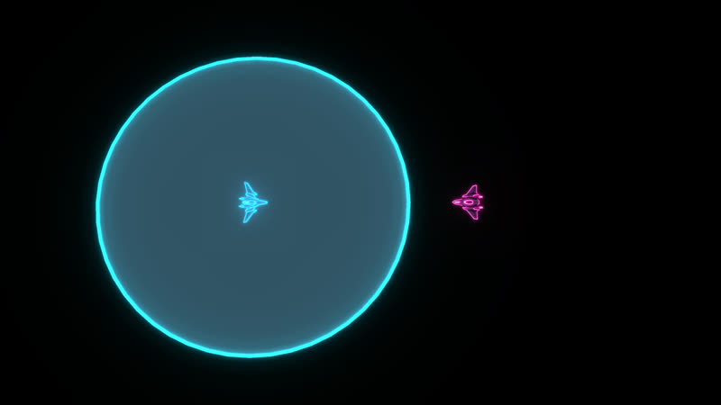

# Neon Drift Arena — the manual

Everything the game does. For build and deploy notes see [DEVELOPING.md](DEVELOPING.md).

## Controls

| Slot | Source | Turn | Strafe | Thrust | Reverse | Boost | Fire | Special | Rematch |
|------|--------|------|--------|--------|---------|-------|------|---------|---------|
| P1 | Keyboard | A / D or arrows | Q / E | W / Up | S / Down | Shift | Space | F | Enter |
| Any | Gamepad (slot from lobby or SETTINGS) | Right stick X | Left stick X | Left stick up | Left stick down | A / LT | RT | RB | Start |
| Any | Phone (`pad.html`) | Left thumb direction | Strafe slider | Left thumb past half deflection | - | BOOST button | FIRE hex | SPECIAL button | ☰ |

The keyboard column is the default map, not a fixed one: SETTINGS > KEY BINDINGS lists every keyboard action and rebinds it. Fire on a row captures the next key you press and makes it the only key for that action, `▶` captures a key and adds it as an extra one, `◀` drops the last extra, and Esc cancels a capture. A key that is another action's last remaining key is refused, and RESET KEYS puts the whole map back. Whatever the map says, Enter and Esc always still reach the menus, so a rebind can never lock you out. Every key name the game prints — the lobby legend, the settings hints, the HOW TO PLAY card — comes from the map, and from your keyboard layout, so an AZERTY board reads Z Q S D.

SWAP STICKS in SETTINGS > CONTROLLERS flips the stick roles per pad. `M` mutes everything, music included (that one is fixed); SETTINGS > AUDIO sets MUSIC and SOUNDS levels (left/right steps 10%, Fire toggles OFF/100%).

SETTINGS lives in the lobby: a READY player moves down to the SETTINGS entry and confirms. The panel is a single controller-driven list - up/down moves, left/right adjusts, A/Space toggles, B/Esc goes back - covering controller slots, SWAP STICKS, KEY BINDINGS, ARENA and AUDIO. The TUNING rows (every tunable in `Cfg`, plus RESET) are a developer tool and only show with `?dev=1` in the URL.

## The lobby

The lobby opens pre-seeded: the keyboard holds P1 and a bot holds P2, so one player can press Start and be in a match immediately. Every other device presses Fire or A to claim one of the remaining slots (explicit slot from SETTINGS, else the first free one). A card shows the device's own name where it has one — the gamepad's model, or your CrazyGames username — and a bot's card reads BOT. On your ship card, left/right picks your colour - CYAN / MAGENTA / LIME / AMBER, never two players on the same one - or your side in TEAMS mode, Fire confirms you as READY, and Back (Esc / B) un-confirms, then leaves. Down moves you from your card onto the shared menu row below the slots, where left/right moves the cursor and Up (or Back) returns to your card; the cursor pulses and shows the tags of the players sitting on it, and a card whose player went down dims with a ▼. MODE cycles FREE FOR ALL, TEAMS, PRACTICE and RACE (any change resets everyone to unconfirmed), START launches, SETTINGS opens the panel. A device whose saved slot is already taken joins the first free slot instead. START only lights up with 2+ players, everyone READY, and - in TEAMS - both sides filled; Start (Enter) launches from anywhere once that holds. Teammates share a colour, do not damage each other, and win together. Slots not in the lobby are ignored during the match. Every launch opens with a 5 s countdown while the camera flies low over the four spawn rings - each lit in its ship's colour with the player's tag floating above - and resuming from pause counts 3-2-1 from the normal view. Start during play opens the pause menu (RESUME / RESTART MATCH / QUIT TO LOBBY); the result screen offers REMATCH / QUIT TO LOBBY. Menus navigate with stick, d-pad or W/S, confirm with A / Fire / Start, back with B / Esc.

The lobby's menu row holds MODE, ARENA (the five layouts plus RANDOM, rolled at every launch and rematch), MUTATOR (NONE, RAILS ONLY - every crate is a railgun, TURBO - half again as fast in every axis, ICE - a quarter of the drag), ADD BOT (fills the first empty slot with a chase-and-shoot bot; when the lobby is full it turns into CLEAR BOTS), SETTINGS and START. Wins carry across rematches as ★ on the cards and on the result screen; the first to 5 takes the series and the tally resets, as it does whenever the roster or mode changes. On the result screen Back leaves your slot and a device that is not in yet joins with Fire, so a pad can change hands before REMATCH. Mid-match drop-in works too: a pad, phone or the keyboard that is not in the game presses Start or Fire and its ship spawns straight away with full stocks - into a free slot, or in place of a bot when the lobby is full - with a "JOINS THE FIGHT" shout. No menu, no restart. SETTINGS > ARENA has a CATCH-UP toggle (on by default): the ship with the fewest stocks respawns with a full boost bar and a shield. Beside it a REDUCE FLASHING toggle (off by default) kills every flash - the takedown and GO screen washes, the white flash disc on a takedown and the bloom surge - and a SCREEN SHAKE toggle (on by default) covers the motion, the camera jolt and the HUD panel shake, so flashing can be turned down without giving up the shake.

## Play from your phone

The lobby shows a QR code with the pad URL; the pause menu shows it again. A phone that opens it becomes a controller: JOIN, then ◀ ▶ picks the colour (or side in TEAMS), the big button readies up, BACK and START match the gamepad buttons. In play the left half is a floating stick — the ship turns toward the thumb at the keyboard turn rate and thrusts once the thumb is near the rim (`padAimOn` / `padThrustOn` in TUNING) — the middle column shows that player's hull, boost, stocks and kills, and the right panel holds the SPECIAL, BOOST and FIRE hexes (hold them) with a strafe slider underneath; ☰ in the header pauses. Pause and result menus turn the phone into ▲ ▼ OK BACK. A phone silent for 2 s drops out of the lobby, and at most four phones are tracked at once.

The pad relay carries input, nothing else - the match still runs entirely in the host browser.

A second PC on the LAN can open the game URL itself. The first browser to open the game is the host and runs the simulation; every later one becomes a mirror: it sends its keyboard and gamepads to the host as `LAN PC` devices (join with Fire like a phone) and renders the host's world, menu and banner as they arrive. If the host closes, the mirror falls back to a local lobby after a second. LAN mirroring works on the dev server only.

## On CrazyGames

Playing on CrazyGames adds a few things the standalone site does not have:

- **Sign in** from SETTINGS > CRAZYGAMES. Your CrazyGames username becomes your player tag, and it updates the moment you sign in — no restart, no blocking prompt. Play as a guest and nothing is lost.
- **Your progress follows you.** Best kill count and matches played are saved to your CrazyGames profile, so they are the same on any machine you sign in on.
- **Invite a friend** through CrazyGames and their link drops them straight into your room.
- **Ads.** A short ad plays between the end of a match and the result screen; the game pauses and goes silent for it. There are no banner ads.
- CrazyGames' own mute control silences the game, and the in-game `M` cannot override it.

## Rules

- 3 stocks each, 100 HP. Bullets deal 20 and knock the target back. Ramming exchanges momentum and deals damage proportional to closing speed.
- The clock at the top counts down from 2:30. At zero it is SUDDEN DEATH: heal pads go dark and the border closes over 40 s to 45% of the arena, killing anything left outside.
- A ship respawns at whichever of the two spawn points farthest from enemies the match seed picks, never at a camped corner. Its tag shows for the 1.5 s of spawn protection.
- Out of stocks? You become a launcher: a chevron in your colour on the arena rim, moved around the edge with the stick (or A/D). Fire hurls a rolling rock from there straight at the centre every 6 s. Rocks bounce, stun and hurt every ship they touch, block bullets, shatter on asteroids and any takedown credits you in the feed. Launchers never win and are not in the camera frame.
- `B` swaps between LAUNCHER and GHOST at any time while you are out of stocks; the panel shows the mode's icon and the swap key. As a ghost you drift anywhere inside the arena, untouchable and invisible to the camera, and Fire drops a live mine every 8 s instead of hurling a rock.
- The kill feed under the clock reads killer, weapon icon, victim; a ring-out shows the exit arrow. A red arc around your ship points at the nearest incoming bullet, rolling rock, seeker, live mine or a railgun/tractor charging at you, brighter the closer it is.
- Bots chase the nearest enemy, fire when lined up, use whatever crate they grab, and steer clear of rocks and the closing border.
- The blaster runs on heat, not a magazine: every shot adds heat, sustained fire hits 100 and locks the gun until the heat is fully vented. A ring around the ship reads the heat, white-hot down to red, and the ship vents to space until it clears.
- Below 25 HP a ship smokes and runs 25% slower in every axis - turn, thrust, boost, strafe and top speed.
- Four heal pads sit at the far ends of the two lanes: +40 HP, 30 s respawn, ignored by a ship at full health.
- Boost drains at 21/s and only refills from pads: eight ring pads give 26, the centre pad refills fully. Pads respawn 7 s after pickup. All pads sit inside two narrow lanes (a cross through the centre) walled by asteroids.
- Asteroids block bullets and bounce ships; a bump stuns the ship for 0.6 s and sends it spinning.
- Every 20 s a violet wormhole pair opens on two free spots for 12 s. Anything that crosses one ring - ships, bullets, seekers, mines, rocks - pops out of the other ring at the same speed and heading. A ship gets half a second before it can warp again. No new pairs open in sudden death.
- Every 35 s a black hole opens on a free spot for 15 s: a black disc with a bright violet horizon and a swirl of light falling in. It never moves. It drags ships, bullets, seekers, mines and rocks toward it with a pull that grows sharply near the horizon; touching the core destroys the ship, credited to whoever hit it last. The danger arc points at it when you are inside the pull. None open in sudden death.
- Leaving the arena border by more than 60 units destroys the ship.
- Firing recoils the shooter, so the blaster doubles as a reverse thruster.
- Every sim event drives a synthesised voice — the effects use no sample files; only the music is streamed (SETTINGS > AUDIO has separate MUSIC and SOUNDS levels). Browsers keep audio suspended until a key or click, so a gamepad-only session stays silent until someone touches the keyboard or the window; the lobby's note line says so until sound is unlocked.

## Weapons

The blaster is always on RT. Crate weapons are a **special** on RB, fired independently, so you never lose your gun.

Four weapon crates sit in the arena at all times, one per quadrant. Grabbing one hands out a random loadout - MAG MINES and SEEKERS common (3/18 each), REPULSOR, SCATTER GUN, TRACTOR, BARRIER and SENTRY uncommon (2/18 each), RAILGUN and TIME BUBBLE rare (1/18 each) - and that crate reappears 10 s later on a free spot. Spend the ammo and the special is gone.

| Weapon | Behaviour |
|--------|-----------|
| RAILGUN | Hold RB to charge 1 s, release fires a full-arena beam that pierces ships and asteroids. **One hit kills.** Heavy recoil, and letting go early loses the charge. |
| MAG MINES | Drops a dormant orb behind you. An enemy inside 130 units arms it; it then chases them and detonates 1.5 s later, hurting anyone in the blast - you included. |
| SEEKERS | One homing missile per RB press, not a volley. 34 damage, so a full salvo of three is a kill; chases for 12 s. |
| REPULSOR | No damage: a forward cone of pure knockback. Ring-outs count as your kill. |
| SCATTER GUN | Two shots of electrical discharge: a forward cone reaching half a blaster shot that knocks out every enemy in it for 1 s and chips 12 HP. |
| BARRIER | Two charges. RB plants a glowing wall 60 units ahead, across your nose. It swallows every bullet that touches it - yours included - and bounces any ship that runs into it. Gone after 6 s. |
| SENTRY | One charge. RB drops a hexagonal turret at your tail. It tracks the nearest enemy inside 420 units and fires your blaster at them every 0.25 s, never at you or your team. It has 60 hull, enemy fire chews through it, and it packs up after 15 s. |
| TIME BUBBLE | One charge. RB drops a 220-unit dome of slow time around you that lasts 4 s. You and your team pass through untouched; every enemy ship, bullet, mine and rolling rock inside runs at 40% speed, cooldowns and all. |

### Every special, up close

Each shot is the weapon firing in the sandbox (`combat.html`), stripped to the two ships and the effect itself.

| | | |
|---|---|---|
|  **RAILGUN** |  **MAG MINES** |  **SEEKERS** |
|  **REPULSOR** |  **SCATTER GUN** |  **TRACTOR** |
|  **BARRIER** |  **SENTRY** |  **TIME BUBBLE** |
| TRACTOR | Two charges. Hold RB to charge like the railgun; a faint bubble shows the reach (half a blaster shot). On full charge it latches the thing you are facing, enemy ships first, then asteroids. A ship gets dragged toward you for 1.4 s so you can ram it; a rock reels you in instead. |

## Race mode

MODE → RACE turns the ARENA row into a track picker - GRAND PRIX (a full-width circuit with a dozen corners), HAIRPIN (two tight right-handers and an S between two long straights) and INFINITY (a figure of eight that crosses itself in the middle) - and RANDOM rolls among tracks. The intro fly-by follows the road instead of the spawn rings. Tracks sit in a bigger arena than the battles (1800 half-width against 1350) and the road is smoothed through every corner, drawn as a ribbon of two neon edges with a yellow start line; every few bends a violet portal ring sits on the road as a checkpoint, the finish ring is yellow. You must fly through the portals in order, so cutting the infield gains nothing; the rings you have to take next glow, and when nothing is threatening you the arc around your ship turns violet and points at your next portal. The panel shows `LAP n/3` instead of stocks and the clock counts up. The blaster is off - RACE is about piloting, not shooting - and crates only hand out SCATTER GUN, CONTACT MINES (a race-only variant: the mine sits still where you drop it and blasts the first enemy that touches it) and a single MISSILE (the race-only seeker: it flies straight, no homing); any hit that would hurt stuns for a second instead, so hulls never drop and the only way to wreck is to leave the arena. Nobody loses stocks: a wreck respawns after 3 s at the last checkpoint you crossed, facing the next one. No match clock, no sudden death, no wormholes or black holes. Crossing the start line after the last lap parks the ship, shouts its place and starts a 20 s grace period; the race ends when everyone is in or the grace runs out, and the first across the line wins. `laps`, `gateRadius` and `raceGrace` live in SETTINGS > TUNING (`?dev=1`).

## Practice mode

PRACTICE starts as soon as one player from any device - keyboard, gamepad or phone - has joined and pressed Start (no READY needed), and drops a passive target bot into the first free slot. Everyone lines up on the left facing the target, with a crate above the centre and a dormant mine below. Nobody loses stocks, so the range never ends until QUIT TO LOBBY. The crate reappears a second after every grab and hands out the weapons in order - RAILGUN, MAG MINES, SEEKERS, REPULSOR, SCATTER GUN, TRACTOR, BARRIER, SENTRY, TIME BUBBLE - so a pad can cycle through all of them. With a keyboard in the game, `0`–`9` arm it directly (0 = BLASTER), `K` kills the target, `G` turns the keyboard player into a launcher, `T` jumps to sudden death and `R` resets the stage.
