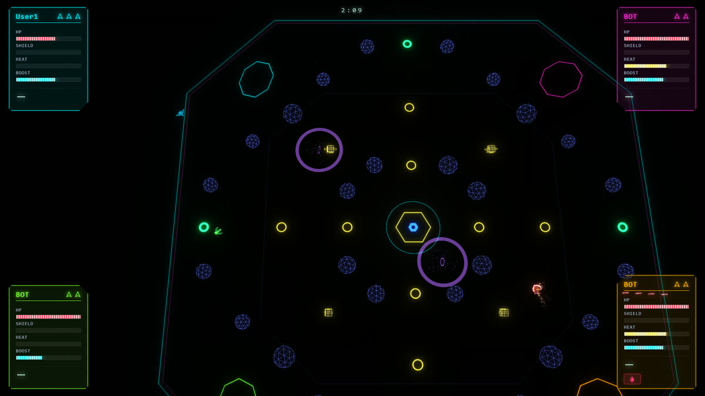
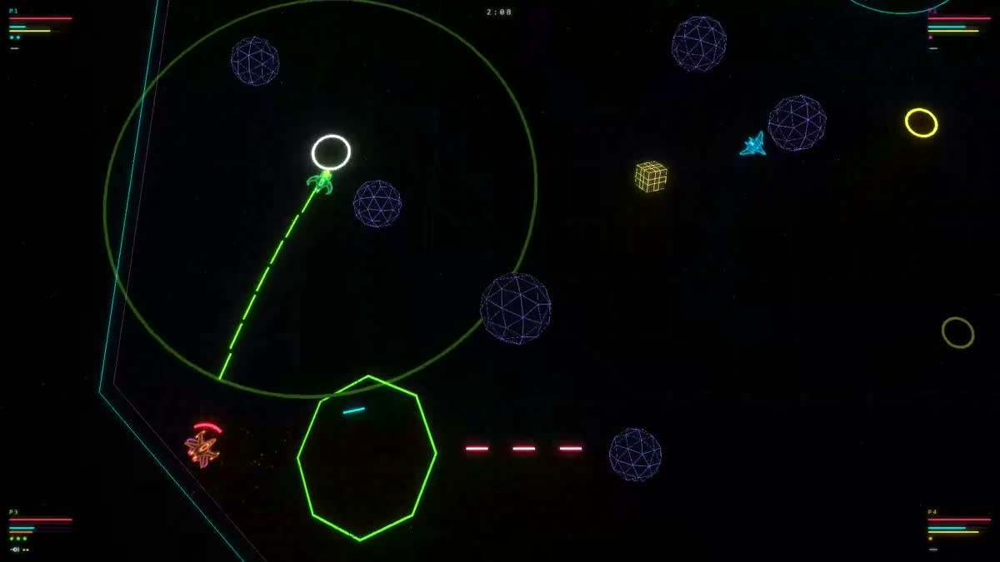

<h1 align="center">NEON DRIFT ARENA</h1>

<b>Four ships. One couch. Last ship flying wins.</b>

  <a href="https://neondriftarena.com/"><b>▶ PLAY FREE — neondriftarena.com</b></a>

  Free in your browser · No download · No account · 2 to 4 players on one screen

## Asteroids drift with a gun that kicks back

No brakes. You keep the momentum you built, and every shot shoves you backwards — so the blaster doubles as your reverse thruster. Ram at speed and you both pay for it.

Grab a crate and you get a **special** on its own button: a one-shot railgun that pierces the whole arena, homing seekers, mines that hunt you down, a tractor beam that drags a rival into your nose, a barrier that eats incoming fire, a sentry turret that covers your back, a bubble of slow time you can drop on a chaser. Wormholes open, black holes swallow bullets, and when the clock runs out the border closes in until only one ship is left.

Out of stocks? You are not out of the match — you take the rim as a launcher and hurl rolling rocks at whoever is still alive, or press B to roam the arena as a ghost dropping mines.

## Bring whatever you have

| | |
|---|---|
| ⌨️ **Keyboard** | One player, straight away. |
| 🎮 **Gamepads** | Up to four. Drop in mid-match by pressing Start. |
| 📱 **Phones** | Out of pads? Scan the QR code in the lobby and a phone becomes one. |
| 🤖 **Bots** | Fill the empty seats and actually fight back. |

## Four ways to lose a friendship

- **FREE FOR ALL** — three stocks each, last ship flying wins.
- **TEAMS** — two against two, shared colour, no friendly fire.
- **RACE** — same physics, a circuit instead of an arena. Portals for checkpoints, weapons that stun instead of kill.
- **PRACTICE** — a target dummy, every weapon on tap, nothing on the line.

Five arena layouts, three race tracks, and mutators that turn everything into railguns, crank the speed by half, or drop the drag to a quarter.

## Play it

**[neondriftarena.com](https://neondriftarena.com/)** — free, in the browser, nothing to install.

Needs a modern desktop browser. It is a couch game: a keyboard or gamepads and a screen everyone can see. Phones are welcome as controllers, not as the screen.

Coming to Steam, CrazyGames and itch.io.

## Made with

F# compiled to JavaScript with [Fable](https://fable.io/), rendered with Three.js. Every sound is synthesised in the browser — there are no audio files. The whole match runs in one tab.

- [GAMEPLAY.md](GAMEPLAY.md) — controls, rules, weapons, every mode
- [DEVELOPING.md](DEVELOPING.md) — build, test, deploy, file layout

A game by Victor Granda.
